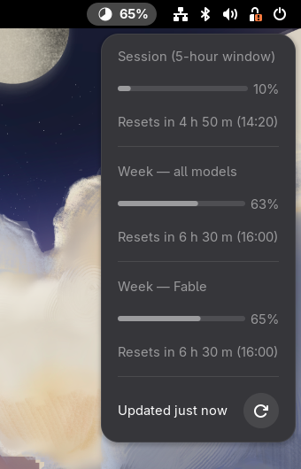

# Claudometer

A GNOME Shell extension that shows your Claude Code usage in the top panel
— how close you are to the session and weekly rate limits — without ever
spending a token to check.



## What it shows

- A small clockwise-fill gauge in the top panel showing the **constraint**:
  the rate-limit window (5-hour session or weekly) you will hit first, with
  optional percent text next to it.
- A dropdown with per-window detail — session window, weekly (all models),
  per-model weekly limits — each with a progress bar and reset time, plus a
  data-freshness footer.
- A preferences window: panel position, what the panel shows, refresh
  behavior.

Claudometer reads the usage state Claude Code already keeps locally and
never calls the Claude API or invokes the model — checking your usage never
consumes your usage. That guarantee is the point of the project; see
`VISION.md` and `designs/RFC-001-usage-data-source.md` for how it is kept.

Requirements: GNOME Shell 49, Claude Code installed and logged in with a
subscription plan. API-key-only (pay-per-token) setups have no rate-limit
windows and render as an explicit "unavailable" state by design.

## Install

### From a release zip

Download `claudometer-v<version>.shell-extension.zip` from the
[releases page](https://github.com/IllyaYalovyy/claudometer/releases) and
run:

```bash
gnome-extensions install --force claudometer-v<version>.shell-extension.zip
```

GNOME Shell only discovers newly installed extensions at startup: on
Wayland, log out and log back in (on X11, restarting the shell with
Alt+F2, `r` also works). Then enable it:

```bash
gnome-extensions enable claudometer@illyayalovyy.github.io
```

### From source

```bash
git clone https://github.com/IllyaYalovyy/claudometer.git
cd claudometer
./scripts/package.sh
gnome-extensions install --force dist/claudometer-v*.shell-extension.zip
```

`scripts/package.sh` runs the full quality gate first and refuses to pack
if it fails. The artifact version comes from `version-name` in
`src/metadata.json`.

For the fast development loop (symlinked working tree, headless-Shell
manual testing, reading logs), see `docs/DEVELOPING.md`.

## Status

The MVP — panel gauge, dropdown, preferences, and the zero-token data
source decided in `designs/RFC-001-usage-data-source.md` — is implemented
and tracked to completion in the
[MVP milestone](https://github.com/IllyaYalovyy/claudometer/milestone/1).

## Contributing

See `CONTRIBUTING.md` for the working rules and quality bar. If you clone
this repository fresh, install the local AI-file commit guard (it lives in
`.git/hooks/`, which `git clone` never carries):

```bash
./scripts/install-git-hooks.sh
```

### Project Workflow

The default workflow is intentionally simple:

1. Write or update the user task / problem statement.
2. Create an RFC for broad, irreversible, cross-cutting, or dependency-adding
   changes.
3. Implement in small reviewable steps.
4. Add tests at the layer where the risk lives.
5. Run `./scripts/quality.sh`.
6. Review for behavior, regressions, secrets, and maintainability before merge.

### Repository Layout

```text
.
├── AGENTS.md                    # Instructions for AI coding agents
├── CONTRIBUTING.md              # Contributor rules and quality bar
├── VISION.md                    # Problem, approach, and what this is not
├── designs/
│   ├── RFC-001-usage-data-source.md  # Decided: zero-token data source
│   ├── UX-DESIGN.md             # Panel indicator + dropdown UX design
│   └── USER-TASKS.md            # User workflow inventory
├── docs/
│   ├── DEVELOPING.md            # Dev loop: install, headless Shell, logs
│   ├── PROCESS.md               # How work moves from idea to merge
│   ├── COMMITS.md               # Commit identity, staging, and message rules
│   ├── TESTING.md               # Testing strategy
│   ├── RELEASE.md               # Release checklist
│   └── prompts/                 # Copy-ready AI prompts for common workflows
├── src/                         # The extension (lib/ is pure, gjs-testable)
├── tests/                       # Headless unit tests + committed fixtures
└── scripts/
    ├── quality.sh               # Local quality gate (hooks in quality.d/)
    └── package.sh               # Build the installable release zip
```

### Quality Gate

Run the local quality gate before asking for review:

```bash
./scripts/quality.sh
```

It checks shell syntax, `metadata.json`, the GSettings schema, JS syntax,
the committed fixtures, and runs the headless unit tests. Project-specific
checks live as executable files under `scripts/quality.d/`.

### Design Documents

Use `designs/RFC-000-template.md` for changes that are hard to reverse,
touch multiple parts of the system, add dependencies, or change external
behavior. Use `designs/USER-TASKS.md` to keep user-facing workflows
explicit and testable.

This repository was initialized from `ai-proj-template`; see
`docs/TEMPLATE-RATIONALE.md` for the practices it carries.

### AI Prompt Templates

Reusable prompts live in `docs/prompts/`:

- `task.md` - turn a request into a scoped task
- `rfc.md` - draft or revise an RFC
- `implement.md` - implement accepted work
- `review.md` - review a diff or branch
- `commit.md` - prepare a clean commit

### Task Tracking

Work toward the MVP is tracked as GitHub issues under the
[MVP milestone](https://github.com/IllyaYalovyy/claudometer/milestone/1),
ordered by dependency. Each issue is a self-contained specification with
acceptance criteria and test requirements; the issue body is the source of
truth for its task, and completed tasks are closed with a completion report
comment.

### AI Task Runner (local only)

This project uses `ktask`, a local project-agnostic AI CLI task orchestrator,
to drive queued implementation tasks. `ktask init` creates `.ktask/` in the
repository root; it is gitignored and blocked by the pre-commit guard, so it
never reaches the remote. Anyone working on this repo runs `ktask init`
locally to recreate it — see `ktask --help` or the tool's own README.
